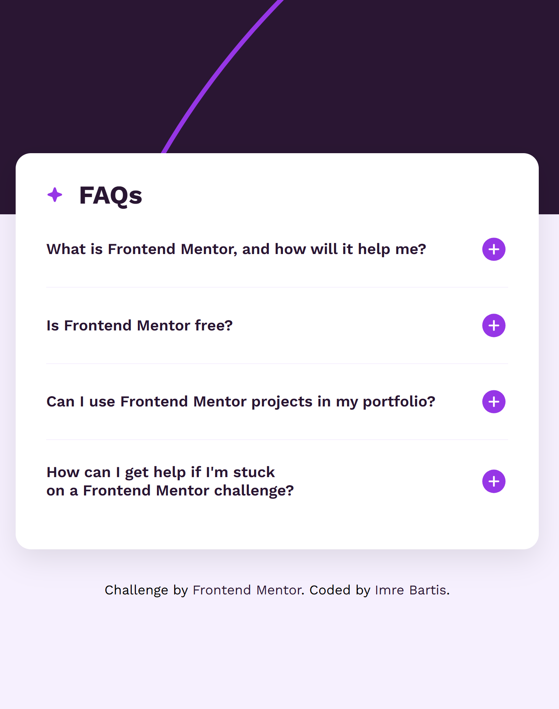
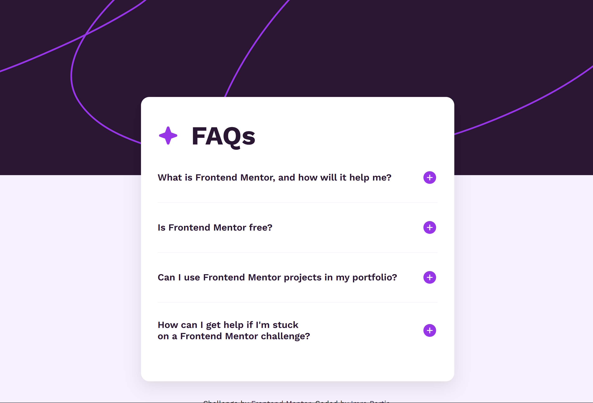

# Frontend Mentor - FAQ accordion solution

This is a solution to the [FAQ accordion challenge on Frontend Mentor](https://www.frontendmentor.io/challenges/faq-accordion-wyfFdeBwBz). Frontend Mentor challenges help you improve your coding skills by building realistic projects.

## Table of contents

- [Overview](#overview)
  - [The challenge](#the-challenge)
  - [Screenshot](#screenshot)
  - [Links](#links)
- [My process](#my-process)
  - [Built with](#built-with)
  - [What I learned](#what-i-learned)
  - [Continued development](#continued-development)
- [Author](#author)

## Overview

### The challenge

Users should be able to:

- Hide/Show the answer to a question when the question is clicked
- Navigate the questions and hide/show answers using keyboard navigation alone
- View the optimal layout for the interface depending on their device's screen size
- See hover and focus states for all interactive elements on the page

### Screenshots





### Links

- Live Site URL: [faq-accordion](https://imrebartis.github.io/faq-accordion/)

## My process

### Built with

- Semantic HTML5 markup
- SASS
- Flexbox
- Mobile-first workflow
- Vanilla JavaScript

### What I learned

During this project, I gained experience in building an accessible and interactive FAQ accordion component. Here are the key learnings:

```html

<!-- Semantic HTML structure with proper ARIA attributes -->
  <h2 class="accordion-item-header" id="item4-header" tabindex="0">
    <span class="accordion-item-title">How can I get help if I'm stuck on a Frontend Mentor challenge?</span>
    <button class="accordion-item-toggle-btn" aria-expanded="false" aria-controls="item4-content"
      aria-labelledby="item4-header" tabindex="-1">
      
    </button>
  </h2>
```
```scss

.accordion-content {
  transition:
    visibility 0.4s ease,
    opacity 0.4s ease,
    height 0.4s ease;
}

/* Responsive design consideration */
@media (prefers-reduced-motion: reduce) {
  .accordion-content {
    transition: none;
  }
}
```

```js

// Keyboard navigation implementation
function handleKeydown(e, headers) {
  if (key === 'ArrowDown' || key === 'ArrowUp') {
    // Navigate between accordion items
  } else if (key === 'Enter' || key === ' ') {
    // Toggle accordion state
  }
}
```

Key takeaways:

- Implementing proper keyboard navigation and ARIA attributes for accessibility
- Managing accordion state with smooth transitions
- Handling responsive design with mobile-first approach
- Writing clean, maintainable JavaScript with error handling
- Implementing user preference considerations (like reduced motion)

### Continued development

For future projects, I plan to focus on the following areas:

- **Enhancing Accessibility**: Continue refining keyboard navigation and ARIA attributes to ensure all users can interact with the component effectively.
- **Improving Performance**: Optimize JavaScript execution and CSS transitions to improve the overall performance of the accordion.
- **Responsive Design**: Explore more advanced responsive design techniques to ensure the component looks and functions well on various devices and screen sizes.
- **Unit Testing**: Enhance the unit tests to cover more edge cases and improve test coverage.

## Author

- Frontend Mentor - [@imrebartis](https://www.frontendmentor.io/profile/imrebartis)
